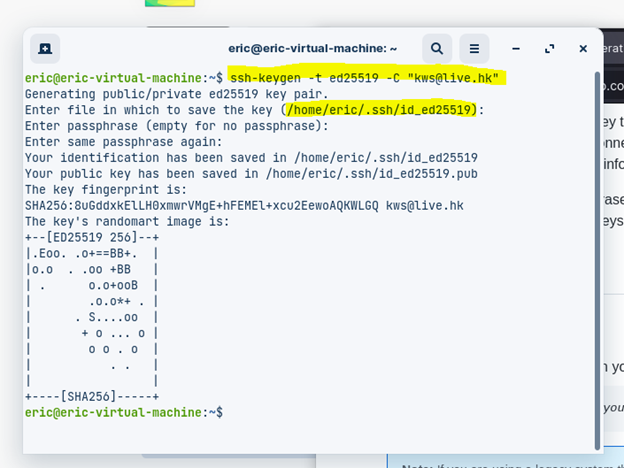
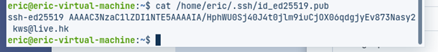
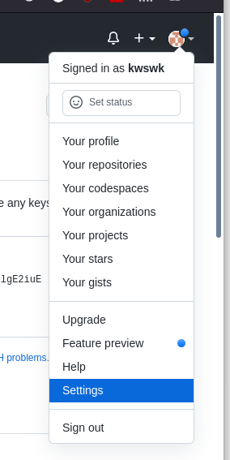
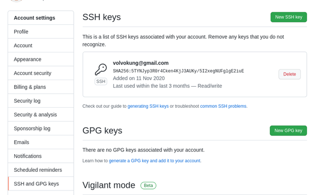
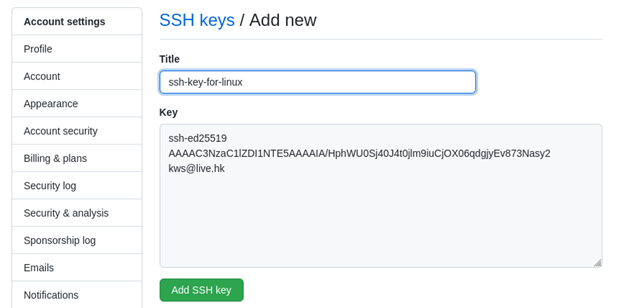
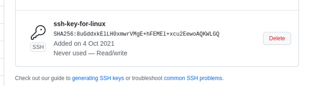
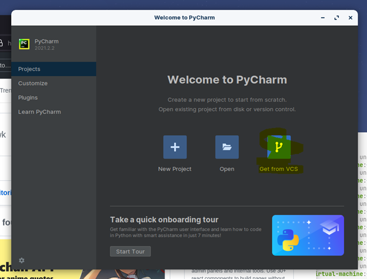
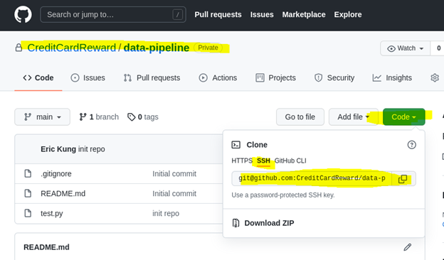
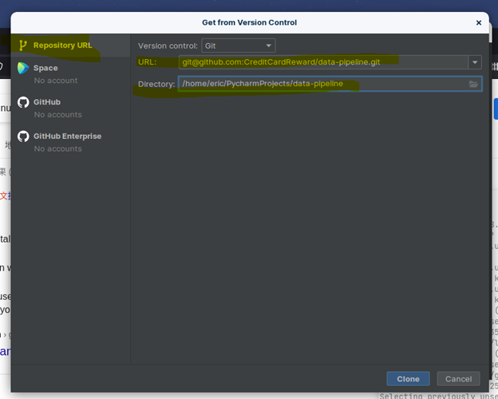
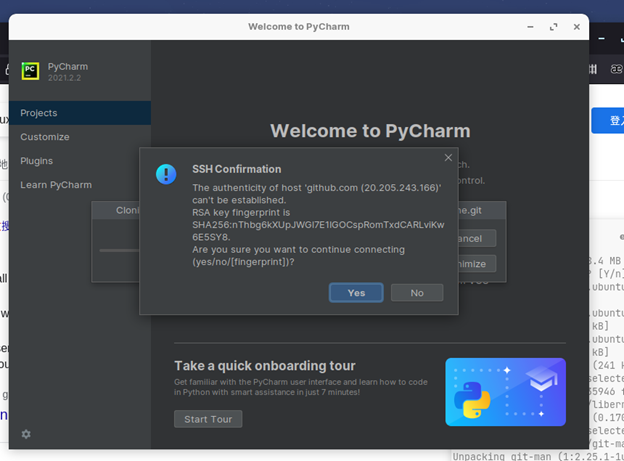

Guide to setup ssh key and connect PyCharm to github

1. Generate SSH Key in local desktop

    This will be your unique key to open the door (github). Follow below steps:
    
    1. Open Terminal in Mac / Linux
    2. input below command (replace the email with your github login)

       `ssh-keygen -t ed25519 -C "your_email@example.com"`
    3. A default key path will be shown on the screen. Let's not changing it and press enter :) 

       (in my example, it is saved as `/home/eric/.ssh/id_ed25519.pub`)
    4. Ignore those message generated by system. We would like to look at the value 
    stored in the key file with below command:

        `cat /home/eric/.ssh/id_ed25519.pub`
   
   
    
    5. Copy the key

2. Add your key to Git
   
   You have a key but you have to inform github so that you can open the door successfully :)

    1. Login to Github >> click on your avatar >> Settings >> SSH and GPG Keys
   
    
    

    2. Click "New SSH Key" and paste the Key you got in Step 1 (from the Terminal) >> Add SSH Key
    

    3. Done!
    !

3. Clone the report to Pycharm
    You are all set! You can push and pull commits to/from github anytime

    1. Open Pycharm >> Get from VCS
    

    2. In the Git repo, copy the SSH address
    

    3. Paste it to the URL and you will get confirmation
    
   